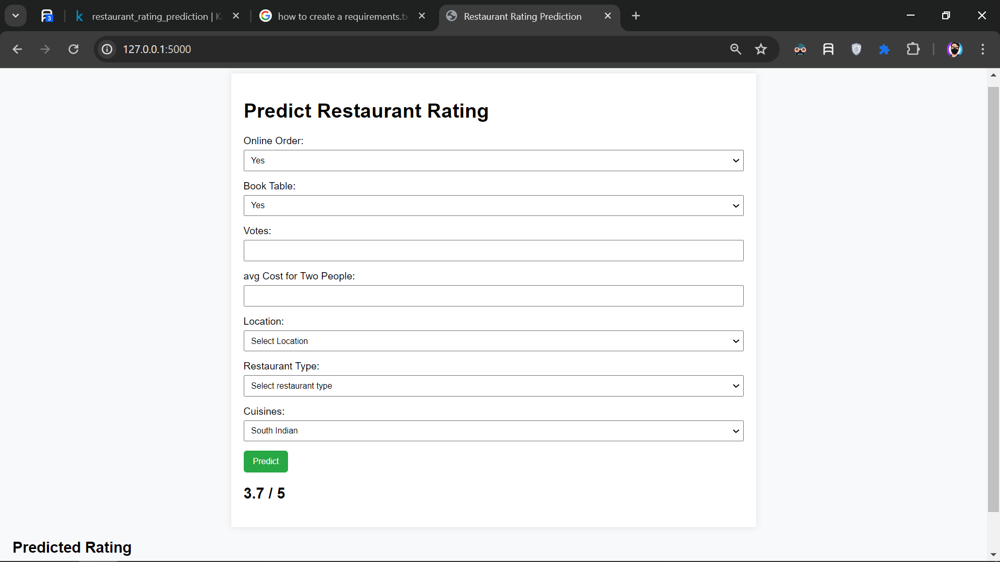

# Restaurant Rating Prediction

This project is about predicting restaurant ratings based on various factors. The dataset used for this project is obtained from [Kaggle](https://www.kaggle.com/datasets/himanshupoddar/zomato-bangalore-restaurants?resource=download).

## Project Structure

The project has the following structure:

- `app.py`: This is the main application file.
- `cuisine_encoder.pkl`, `location_encoder.pkl`, `type_encoder.pkl`, `rating_prediction.pkl`, `scaler.joblib`: These are the trained models and encoders used in the application.
- `restaurant-rating-prediction.ipynb`: This Jupyter notebook contains the exploratory data analysis and model training process.
- `requirements.txt`: This file lists the Python dependencies required by this project.
- `templates/`: This directory contains the HTML templates for the web application.
-

## Web UI

 <!-- Replace '#' with the link to your image -->

<iframe width="560" height="315" src="https://www.youtube.com/embed/PtkyQ4Vm7FA?si=GvBmA8FGs5ho0c0Q" title="YouTube video player" frameborder="0" allow="accelerometer; autoplay; clipboard-write; encrypted-media; gyroscope; picture-in-picture; web-share" referrerpolicy="strict-origin-when-cross-origin" allowfullscreen></iframe>

<iframe width="560" height="315" src="https://www.youtube.com/embed/PtkyQ4Vm7FA?si=GvBmA8FGs5ho0c0Q" frameborder="0" allow="accelerometer; autoplay; clipboard-write; encrypted-media; gyroscope; picture-in-picture" allowfullscreen></iframe>

<video src='https://www.youtube.com/watch?v=PtkyQ4Vm7FA' width=180/>
## Setup and Installation

1. Clone the repository.
2. Install the dependencies listed in `requirements.txt`.
3. Run `app.py` to start the application.
